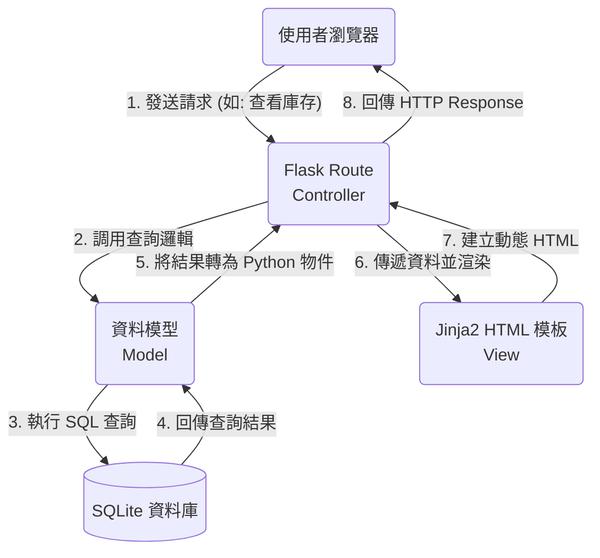

# 系統架構文件 (Architecture)

根據 PRD 需求，本文件規劃了「CS2 賽事數據與飾品投資分析系統」的技術架構、資料夾結構與元件關聯，作為開發前期的技術指引。

## 1. 技術架構說明

**選用技術與原因：**
- **後端框架：Python + Flask**
  Flask 是一個輕量且高彈性的網頁框架，適合本專案中小型規模的業務邏輯處理，並且擁有豐富的擴充套件，對於資料整合的分析系統相當合適。
- **模板引擎：Jinja2**
  隨 Flask 內建，能夠直接在後端將資料注入並渲染成 HTML 頁面。不需建置複雜的前後端分離架構，可以有效加速初期開發速度與降低門檻。
- **資料庫：SQLite**
  以簡單的單一檔案格式儲存結構化資料，不需額外架設龐大的資料庫伺服器，對快速開發、本機測試都非常友善與方便。

**Flask MVC 模式說明：**
在實作上，我們將採用類似 MVC (Model-View-Controller) 的設計模式來讓程式的職責分離：
- **Model (資料庫模型)**：負責與 SQLite 資料庫溝通，處理諸如「歷史戰績」、「飾品價格」、「會員資料」以及「投資組合紀錄」的增刪改查 (CRUD) 邏輯。
- **View (視圖)**：負責最終畫面的呈現，在此專案即為 **Jinja2 模板** (HTML 結構與 CSS 樣式)，用來將 Controller 處理好的變數渲染成使用者看得到的網頁。
- **Controller (控制器)**：由 **Flask 路由 (Routes)** 擔當。負責接收從瀏覽器發送的 HTTP 請求，判斷要做什麼邏輯運算、調用 Model 查詢資料，最後交給 View (Jinja2) 輸出網頁內容。

---

## 2. 專案資料夾結構

本系統的原始碼將統一放置於 `app/` 目錄中，並根據上述 MVC 精神進一步模組化拆分：

```text
web_app_development/
├── app/                        # 應用程式主目錄
│   ├── __init__.py             # 初始化 Flask 應用，建立與配置 App 實例
│   ├── models/                 # Model 層：資料相關邏輯與表格定義
│   │   ├── __init__.py
│   │   ├── user.py             # 會員與權限驗證 Model
│   │   ├── esports.py          # 戰隊與賽事戰績 Model
│   │   └── items.py            # 虛擬飾品與投資組合 Model
│   ├── routes/                 # Controller 層：路由定義 (Blueprint)
│   │   ├── __init__.py
│   │   ├── auth_routes.py      # 註冊、登入與登出邏輯
│   │   ├── esports_routes.py   # 戰績查詢展現邏輯
│   │   └── items_routes.py     # 飾品走勢與個人資產管理邏輯
│   ├── templates/              # View 層：Jinja2 HTML 模板
│   │   ├── base.html           # 全域共用的排版與 Navigation Bar
│   │   ├── auth/               # 存放登入、註冊用 HTML
│   │   ├── esports/            # 存放戰線圖與賽果 HTML
│   │   └── items/              # 存放飾品圖表與投資管理 HTML
│   └── static/                 # 靜態資源檔案
│       ├── css/                # 網頁樣式表 (CSS)
│       ├── js/                 # 客戶端腳本 (如操作 Chart.js 畫圖表)
│       └── images/             # 圖片素材
├── instance/                   # 存放本機或私有檔案，不會預設上傳 Git
│   └── database.db             # SQLite 關聯式資料庫檔案
├── docs/                       # 專案文件 (包含 PRD 與架構文件)
│   ├── PRD.md
│   └── ARCHITECTURE.md         # (本檔案)
├── requirements.txt            # Python 套件依賴清單 (pip freeze)
└── app.py                      # 系統執行入口點 (開發伺服器啟動檔)
```

---

## 3. 元件關係圖

以下展示了使用者在瀏覽器操作時，系統各個核心元件之間是如何互動與相互傳遞資料的：



---

## 4. 關鍵設計決策

1. **Monolithic 單體架構搭配伺服器端渲染 (SSR)**
   - **原因**：為了達成 MVP 並降低初期系統的複雜度，我們選擇不使用當今流行的前後端分離 (如 React + API) 架構。而是統一由 Flask 後端控制並在 Server 端宣染 HTML 後傳給前端。這降低前後端資料串接與部署的門檻，並對 SEO 與首屏加載時間具有優勢；針對圖表等複雜互動，將會在部分頁面以輕量化 Vanilla JS 載入圖表庫來達成動態效果。

2. **採用 SQLite 減輕維運成本**
   - **原因**：針對 MVP 階段的測試與中小型資料存取需求，SQLite 能將所有資料儲存於單一 `.db` 檔案中，可以完全省下專屬資料庫伺服器的設置成本。搭配良好設計的 Model 會讓我們確保未來流量放大時，能輕鬆抽換成 PostgreSQL 或 MySQL。

3. **路由模組化 (Flask Blueprints)**
   - **原因**：單一檔案撰寫所有路由 `app.py` 容易變成義大利麵條程式碼。考慮到我們同時具備「賽事中心」、「飾品市場」、「個人投資」多項目不同屬性的功能模組，系統預先引入了 `routes/` 目錄並以 Blueprint 包裝不同業務邏輯，將大幅提昇未來程式碼的可維護性。

4. **安全與圖表展現考量**
   - **原因**：除了使用 Flask 本身的 Template 機制有效阻擋 XSS 攻擊，對資料庫及登入的部分也會設計基本的 Hash 處理；對於飾品歷史走勢的圖表視覺需求，會在 Jinja 模板中提供 API 接口提供 JSON，交給前端的圖表套件（如 Chart.js）繪製，而非從伺服器產生圖片，確保互動性與效能。
