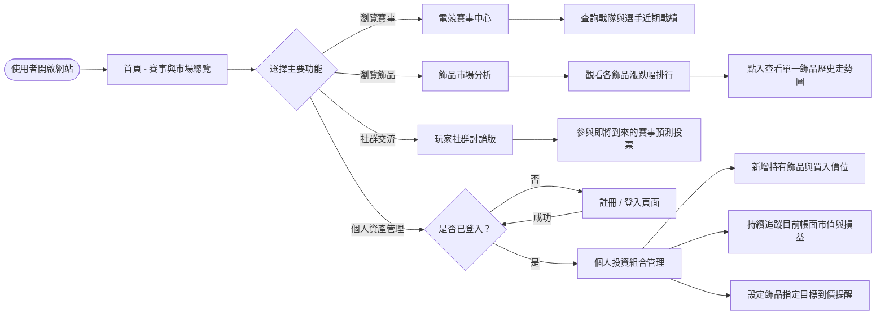
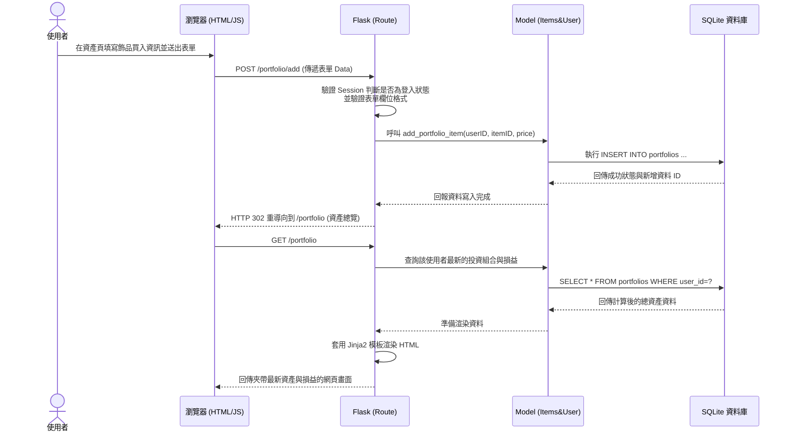

# 流程圖文件 (Flowchart)

根據 PRD 與 架構文件的規劃，本文件將系統互動轉化為視覺化的使用者流程與系統流程，以協助開發前確認邏輯順序無誤。

## 1. 使用者流程圖 (User Flow)

這張圖展示了使用者進入「CS2 賽事數據與飾品投資分析系統」後的可能操作路徑與頁面跳轉邏輯。

---

## 2. 系統序列圖 (Sequence Diagram)

這裡以系統最核心且複雜的動作之一：「**登入狀態下的使用者，新增一筆個人投資資產**」為例，展示 MVC 架構中資料流動的順序。

---

## 3. 功能清單對照表

將上述操作路徑具體對應到未來的 Flask Router 規劃中，下表列出了應用程式預計開發的端點 (Endpoints) 以及各 HTTP 請求方法所做的事情。

| 功能名稱 | URL 路徑 (建議) | HTTP 方法 | 說明與用途 |
| -------- | --------------- | --------- | ---- |
| 首頁總覽 | `/` | GET | 顯示近期重點賽果與市場價格異動較大的頭條 |
| 註冊帳號 | `/auth/register` | GET/POST | 顯示註冊表單(GET) / 驗證並建立新會員資料(POST) |
| 會員登入 | `/auth/login` | GET/POST | 顯示登入表單(GET) / 驗證帳密並發配 Session(POST) |
| 會員登出 | `/auth/logout` | GET | 清除當前 Session，導回首頁 |
| 戰績查詢 | `/esports/teams` | GET | 列出職業戰隊及其近期相關的賽事戰績 |
| 飾品排行 | `/market` | GET | 呈現全站飾品價格漲跌幅排行榜 |
| 歷史圖表 | `/market/item/<id>` | GET | 顯示單一飾品詳細資料，並提供繪製成歷史走勢圖的數據 |
| 資產總覽 | `/portfolio` | GET | 檢視登入會員擁有的所有飾品總價值與當前帳面損益 |
| 新增資產 | `/portfolio/add` | POST | 在資料庫建立一筆使用者的飾品買入記錄（價格、數量等） |
| 到價提醒 | `/portfolio/alerts` | GET/POST | 列出既有提醒(GET) / 設定指定飾品到達特定價格的通知條件(POST) |
| 討論版列表 | `/community` | GET | 查看最新玩家討論文章與目前開放預測的賽事列表 |
| 參與預測 | `/community/predict/<match_id>` | POST | 送出使用者針對某一場賽事的勝負預測結果 |
